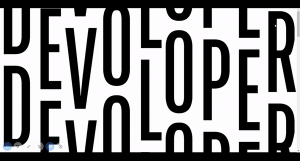
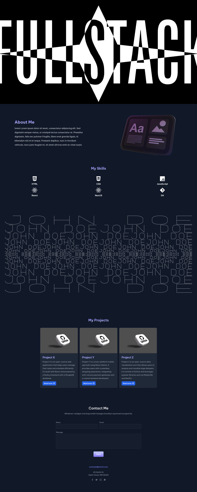

 

# 🚀Modern React Portfolio Template🚀

## How to Start
1. Clone this repo: `git clone https://github.com/ElonMusk2002/react-portfolio-template`
2. Install dependencies: `npm install`
3. Start development server: `npm run dev`
4. Customize and deploy to your own domain

## 🤝 Contributing

If you want to contribute to this project, feel free to open a [pull request](https://github.com/ElonMusk2002/react-portfolio-template/pulls) or an [issue](https://github.com/ElonMusk2002/react-portfolio-template/issues) on GitHub. Before submitting any changes, please make sure you follow these guidelines:

- Check if someone else has already reported the same issue or suggested the same improvement.
- Create a new branch for your changes and use descriptive branch names.
- Write clear commit messages and add comments to your code.
- Make sure your changes are properly tested.
- Update the documentation if necessary.

Thank you for your contributions! 

## 🛠️ Built With

### Tech Stack

## Stats
  

    
    
    
   

   
## Tools Used

## Thanks
I would like to express our gratitude to all contributors and supporters of this project.

Enjoy building your own modern portfolio with ease!
